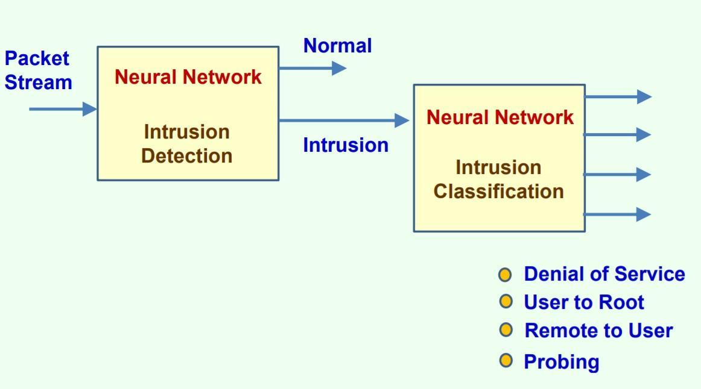

# Intrusion Detection using Deep Learning
Using Deep learning models an Intrusion Detection System is Developed which alerts provides security from different types of cyber attacks like DOS , Revere proxy and other attacks.
</img>

>Using Multi Layer Perceptron an Intrusion Detection System is Developed which assesses the network behavior and  provides security from different types of cyber attacks.
>Used Random Forest Algorithm for Feature Selection & MLP for Classification.
>The model classifies can detectt suspecious network behaviour on the basis of Network characterstics 
>The model can classify different kind of attacks and can alert the system about the any attack behaviour.   
